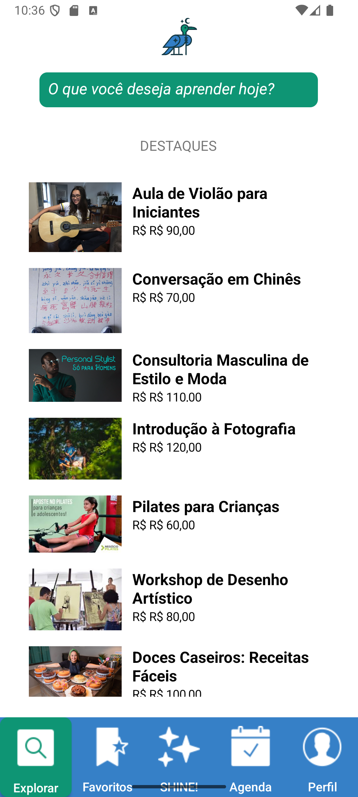
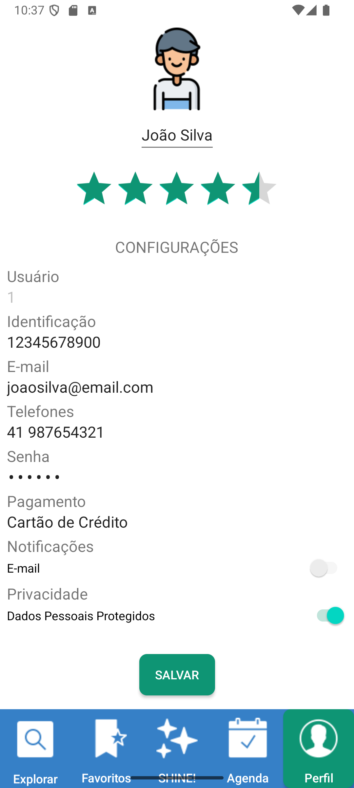
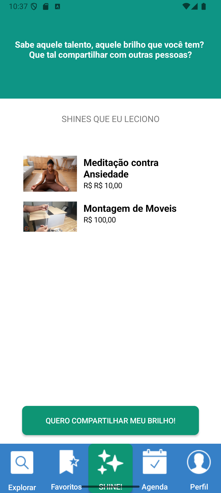

# Shinedown


**Um aplicativo para te ajudar a compartilhar com o Mundo o que você faz de melhor.**

## Linguagens e Tecnologias
- Kotlin
- Gradle 
- MySQL


## Práticas Adotadas
- Responsividade com ConstraintLayout
- Intents
- RecyclerView
- Conceitos de Usabilidade
- Conceitos de Design


## ScreenShots
<div style="display: flex; max-width: 100%; justify-content: space-around;">
    
    
    
</div>


## Rodando
1. Clone o repositório:
   <br> ```git clone git@github.com:aa-abnerandrade/shinedown_CompartilhaSaber.git```
2. Abra o diretório no Android Studio. No terminal integrado, execute:
   <br>```gradle clean build run```
   <br> _Caso não tenha o Gradle em sua máquina,  [siga essas instruções]((https://docs.gradle.org/current/userguide/installation.html))._
4. Utilizando o Device Manager, execute a aplicação:
   <br> Selecione o dispositivo ```Medium Phone API 35```


## Autoria

**Abner Andrade**
<br>_Desenvolvedor Back End_

👋🏽 Me encontre nas redes:
<div style="display: flex">
<a href = "https://www.linkedin.com/in/abnerandrade/"></a>
<a href = "https://api.whatsapp.com/send?phone=5521973257039&text=Oi,%20Abner.%20Vi%20teu%20app%20Shinedown%20no%20GitHub%20e%20gostei!.%20%20Vamos%20trabalhar%20juntos?"></a>
</div>